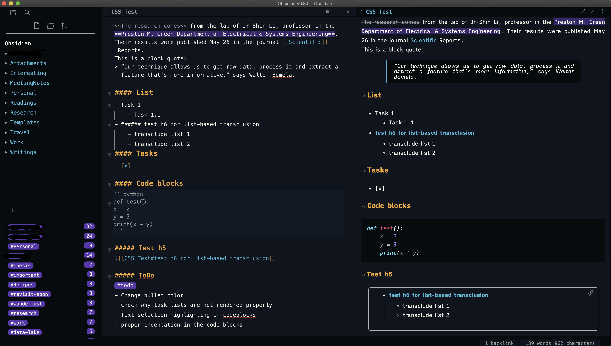

# Obsidian Themes

This is a collection of my favorite themes in Obsidian (mostly all from the dark mode). I am not the creator of these themes but I have modified them to my liking. Currently, this repository has `Dracula` and `Panic Mode`, of which `Panic Mode` is the one I am using currently in all my vaults.

P.S: Checkout https://github.com/jarodise/Dracula-for-Obsidian.md and https://github.com/bcdavasconcelos/Themes/tree/master/Obsidian for the original versions of Dracula and Panic Mode.

## Panic Mode
This is an awesome theme that I used to love and use in Bear. Checkout the sample images for the `Editor` and the `Preview` mode, and the `Graph view`

**Editor and Preview mode**

**Graph View**
